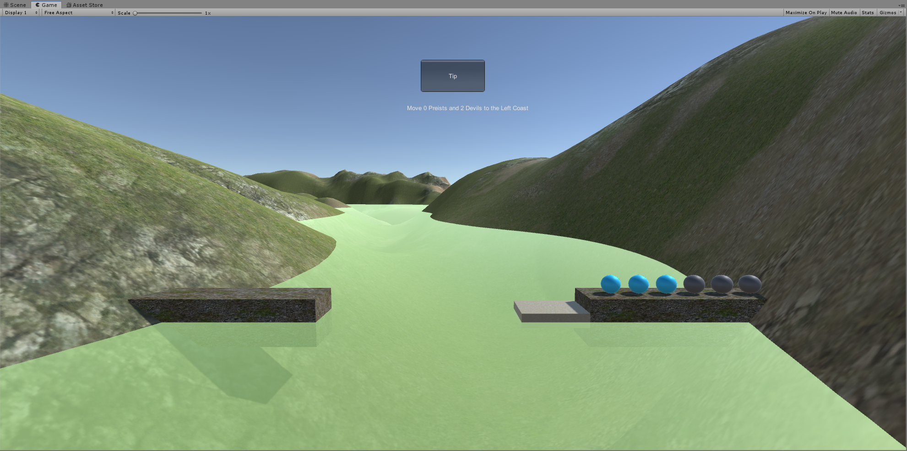

# 智能版牧师与魔鬼

视频连接: https://www.bilibili.com/video/av78385925/

## 游戏截图



## 实现方法

### 确定可行状态

下面以3牧师3魔鬼的情况进行举例分析，规定左边为目的岸，右边为起始岸，任何一个岸边牧师的数量少于魔鬼的数量都会导致游戏的失败，因此排除这类情况，以 (x, y) 的形式表示左岸上牧师和魔鬼的数量，则的剩余的状态有：(0, 0), (0, 1), (0, 2), (0, 3), (1, 1), (2, 2), (3, 0), (3, 1), (3, 2), (3, 3)

简单分析一下，上述的状态主要分为三类：

- 牧师的数量为0，即 (0, i)
- 牧师和魔鬼的数量相同，即 (i, i)
- 牧师的数量为n，即 (n, i)

因此对于牧师魔鬼数量n不为3的时候也能自动生成所有的状态。

```c#
public int count = 3;
public List<State> states = new List<State>();

public class State {
    public int preist;
    public int devil;
    public State(int preist, int devil) {
        this.preist = preist;
        this.devil = devil;
    }
}

public AISystem(int n) {
    count = n;
    // 生成所有可行的状态
    for (int i = 0; i <= count; i++) {
        states.Add(new State(0, i));
        states.Add(new State(count, i));
        if (i != 0 && i != count) {
            states.Add(new State(i, i));
        }
    }
}

public bool ContainState(State state) {
    return state.preist == 0 || state.preist == count || state.preist == state.devil;
}
```

### 寻找可行路径

定义终点状态，并根据当前状态使用BFS算法寻找出一条能够通向终点状态的路径，并给出该条路径的下一步的操作。

```c#
public class Node {
    public State state;
    public bool boatOnLeft;
    public int parent;
    public Node(State state, bool boatOnLeft, int parent) {
        this.state = state;
        this.boatOnLeft = boatOnLeft;
        this.parent = parent;
    }
}

// 将当前状态（右岸上牧师与魔鬼的数量以及船的位置）进行哈希，以记录该状态是否已经遍历
// 该哈希函数限制了牧师与魔鬼的数量应小于10
public int Hash(State state, bool boatOnLeft) {
    return state.preist * 10 + state.devil + (boatOnLeft ? 1 : 0) * 100;

}

// 返回移动的牧师和魔鬼的数量，(0, 0)表示没有找到可行路径
public Tuple<int, int> GetNextStep(int x, int y, bool boatOnLeft) {
    // 如果本身状态不是可行状态，则返回错误
    if (!ContainState(new State(x, y))) {
        Debug.Log("wrong state");
        Debug.Log(x);
        Debug.Log(y);
        return Tuple.Create(0, 0);
    }

    // 定义记录状态遍历形况的字典
    Dictionary<int, bool> vis = new Dictionary<int, bool>();
    foreach (State state in states) {
        vis[Hash(state, false)] = false;
        vis[Hash(state, true)] = false;
    }


    // 定义队列以及初始化
    List<Node> que = new List<Node>();
    que.Add(new Node(new State(x, y), boatOnLeft, -1));
    vis[Hash(que[0].state, boatOnLeft)] = true;
    Node front = que[0];

    // 定义五个移动方向
    int[] dirx = { 1, 0, 2, 0, 1 };
    int[] diry = { 0, 1, 0, 2, 1 };
    int head = 0, tail = -1, xx, yy;

    // BFS过程
    while (head <= que.Count) {
        // 取出队列头元素
        front = que[head];
        xx = front.state.preist;
        yy = front.state.devil;
        boatOnLeft = front.boatOnLeft;

        // 判断是否已经到达终点状态
        if (xx == 0 && yy == 0) {
            break;
        }

        // 判断是否能够移动，5种方案
        for (int i = 0; i < 5; i++) {
            // 船在右岸
            if (!boatOnLeft) {
                if (xx >= dirx[i] && yy >= diry[i]) {
                    State nextState = new State(xx - dirx[i], yy - diry[i]);
                    Node nextNode = new Node(nextState, !boatOnLeft, head);
                    int hash = Hash(nextState, !boatOnLeft);
                    if (ContainState(nextState) && !vis[hash]) {
                        que.Add(nextNode);
                        vis[hash] = true;
                    }
                }
            } else {
                if (count - xx >= dirx[i] && count - yy >= diry[i]) {
                    State nextState = new State(xx + dirx[i], yy + diry[i]);
                    Node nextNode = new Node(nextState, !boatOnLeft, head);
                    int hash = Hash(nextState, !boatOnLeft);
                    if (ContainState(nextState) && !vis[hash]) {
                        que.Add(nextNode);
                        vis[hash] = true;
                    }
                }
            }
        }

        // 更新队列头和队列尾以及船的位置
        head++;
        if (head == tail) {
            tail = que.Count;
        }
    }

    // 递归寻找最开始的那一步
    while (front.parent != 0 && front.parent != -1) {
        front = que[front.parent];
    }

    // 返回下一步该移动的牧师和魔鬼的数量
    if (front.parent == 0) {
        return Tuple.Create(Math.Abs(front.state.preist - x), Math.Abs(front.state.devil - y));
    }

    // 返回错误
    return Tuple.Create(0, 0);
}
```