# AR技术的简单尝试

视频地址： <https://www.bilibili.com/video/av79699172/>

## 游戏截图

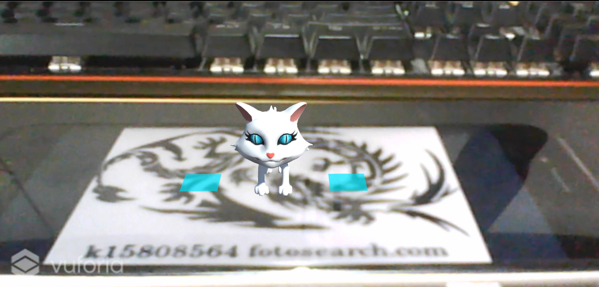

## 实验环境

不同版本的 Unity 2017 以下的版本使用的 AR 脚本以及相应的设置会不一样。

- Vuforia Engine 8
- Unity 2019
- Vusial Studio 2019

## AR SDK的下载与安装

在 https://developer.vuforia.com/downloads/sdk 网站上下载并安装 Vuforia 的 sdk 包。应该要先注册个账号。

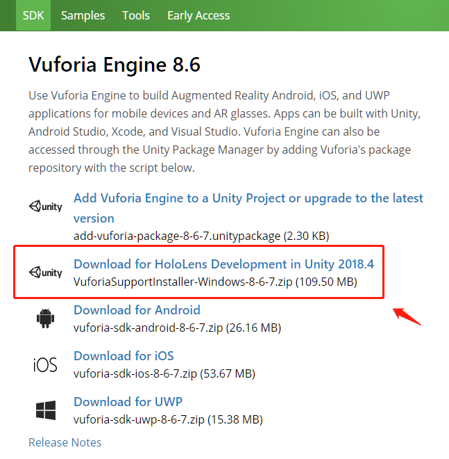

安装完成后创建一个 Unity 3D 项目，依次点击 File -> Build Setting -> Player Settings -> Player，然后展开 XR 栏，选中 Vuforia Augmented Reality Supported，即可完成 Vuforia 包的导入。然后就可以在 GameObject 一栏里看到 Vuforia Engine 了。

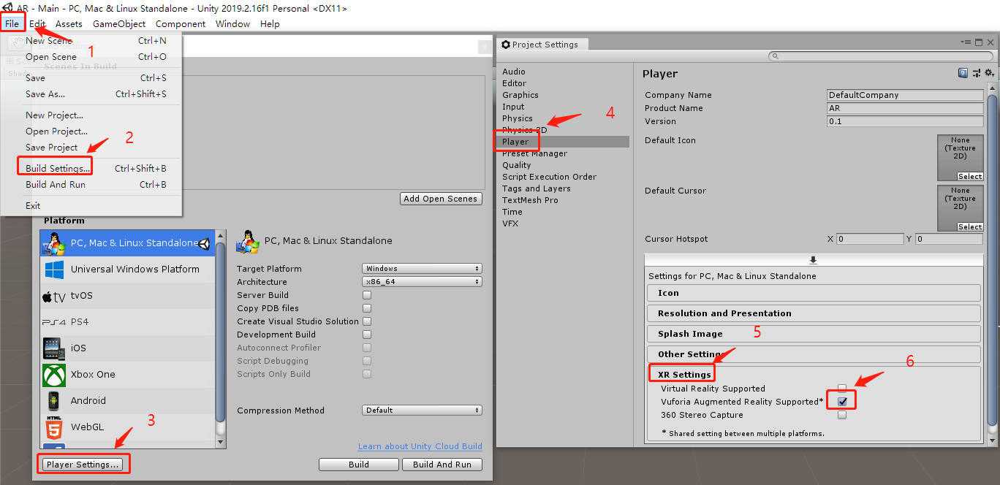

## 获取证书及制作识别图片

回到刚才下载 sdk 的那个网站，在 Develop 页面获取证书，然后点击 Get Development Key。

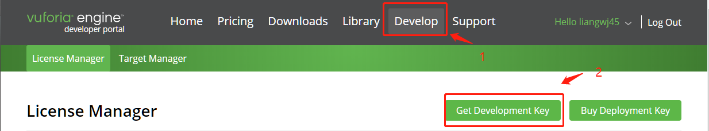

获取完证书后，依次点击 Target Manager 和 Add Database 创建数据库。

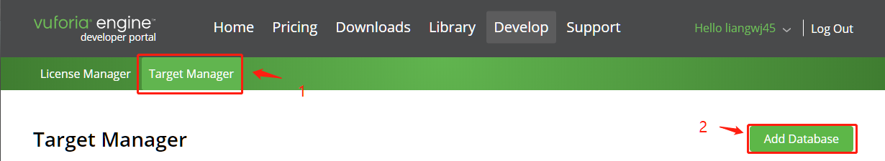

在弹出页面中输入任意名称，点击创建。

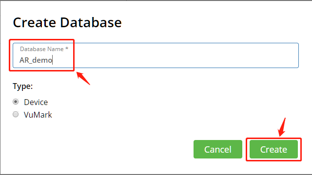

创建后点击数据库名称，进入数据库管理页面。在里面点击 Add Target 按钮添加识别图片。

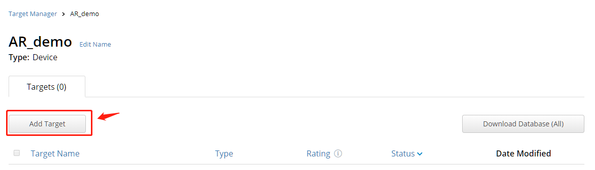

在弹出的界面中选择需要制作的图片，该素材在游戏场景中的大小，以及素材名称，然后点击 Add 添加。

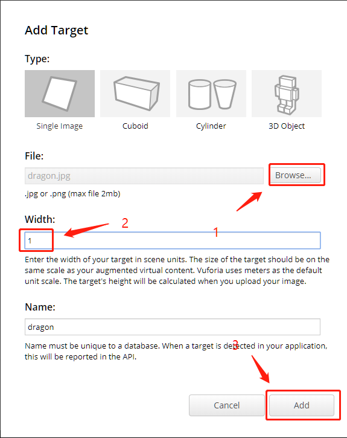

等待处理完成后，点击 Dowmload Database 下载该素材包。

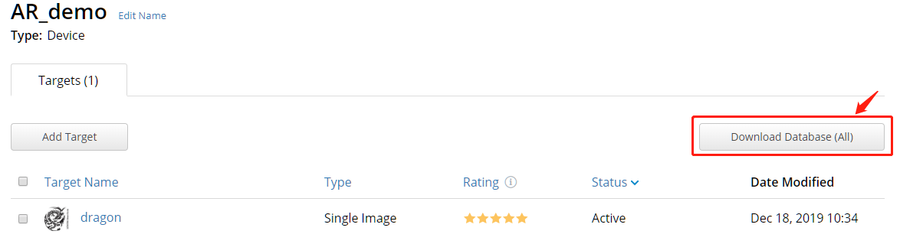

在弹出的页面中选择 Unity Editor。

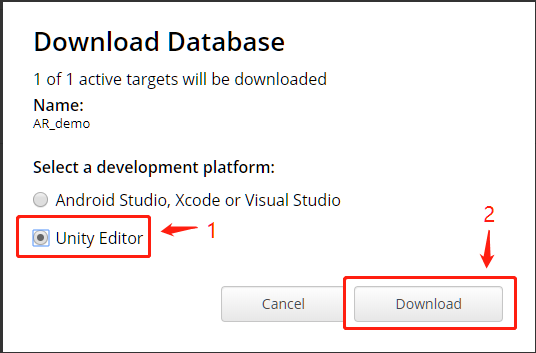

之后就可以在 Unity 中导入该素材了。

## VR Demo 制作

### 添加 AR Camera、ImageTarget 对象以及证书

添加完 AR Camera、ImageTarget 对象之后，在 Resources 目录会多出来一个 VuforiaConfiguration 资源，在该资源的 Inspector 面板中选中 Global 项，并将之前获取的证书粘贴到下面的框。（需要回到网站上复制）

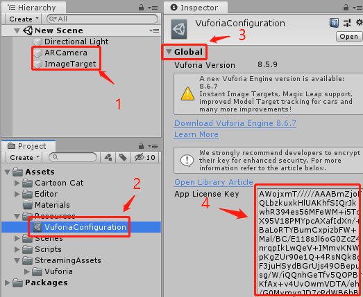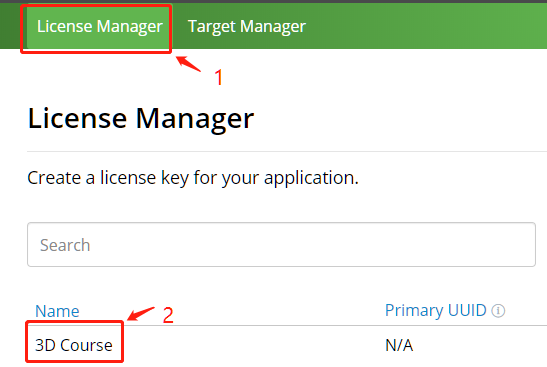

### 修改识别图对象行为

添加完证书之后点击 ImageTarget 对象，在其 Inspector 面板中修改 Image Target Behaviour 组件的属性如下。然后在该对象下绑定另一个素材对象，即在识别到该图像时会将其展示出来。

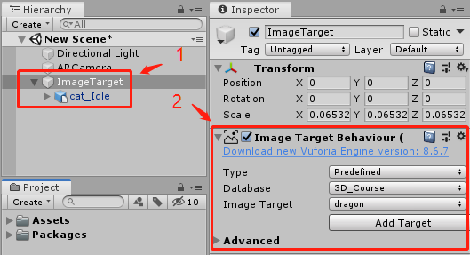

### 添加虚拟按钮

点击 ImageTarget 对象，并在其 Inspector 面板中的 Image Target Behaviour 组件下点击 Advanced，展开后看到 Add Virtual Button 按钮，点击该按钮即可添加虚拟按钮。这里添加了两个虚拟按钮，并为每个虚拟按钮分别添加了一个等尺寸的 Plane 对象，用于对虚拟按钮进行渲染。Materials 可以采用原按钮的 Materials。

注意事项：

1. 虚拟按钮本身是不会显示的，需要将额外的带 mesh renderer 组件的对象绑定在按钮对象上，按钮才会显示出来。
2. 虚拟按钮的触发是通过特定区域遮挡面积来进行判断的，如果发现按钮无法被触发，可能需要调整下按钮的大小以及按钮的位置，如果按钮太接近识别图的边缘，也可能会导致无法被触发。

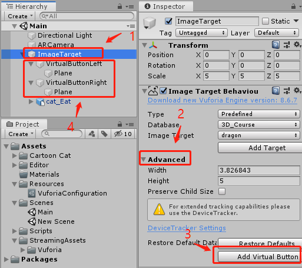

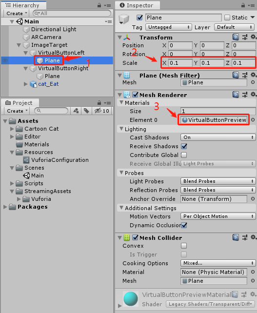

### 设置素材动画

本实验采用的是 Asset Store 里的 Cartoon Cat 素材，直接搜索名称就能找到了。使用了其中的三个状态。在 Animator 中添加三个触发器，并为三个状态分别设置状态切换的条件。

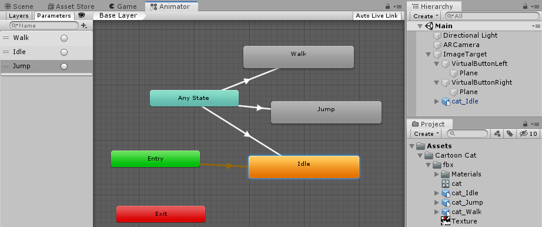

### 注册按钮行为

新建一个脚本文件。并将该脚本文件绑定到 ImageTarget 对象上。

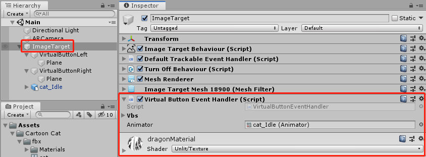

```c#
using UnityEngine;
using Vuforia;

public class VirtualButtonEventHandler : MonoBehaviour, IVirtualButtonEventHandler {
    public VirtualButtonBehaviour[] vbs;
    public Animator animator;

    void Start() {
        vbs = GetComponentsInChildren<VirtualButtonBehaviour>();
        for (int i = 0; i < vbs.Length; i++) {
            vbs[i].RegisterEventHandler(this);
            Debug.Log(vbs[i].VirtualButtonName);
        }
    }

    public void OnButtonPressed(VirtualButtonBehaviour vb) {
        Debug.Log("Pressed");
        switch (vb.VirtualButtonName) {
        case "lvb":
            animator.SetTrigger("Walk");
            animator.ResetTrigger("Jump");
            break;
        default:
            animator.SetTrigger("Jump");
            animator.ResetTrigger("Walk");
            break;
        }
        animator.ResetTrigger("Idle");
    }

    public void OnButtonReleased(VirtualButtonBehaviour vb) {
        Debug.Log("Released");
        animator.SetTrigger("Idle");
        animator.ResetTrigger("Jump");
        animator.ResetTrigger("Walk");
    }
}
```

然后就大功告成了。点击开始按钮，当摄像头识别到特征图时，便会出现可爱的小猫了。

## 运行结果

