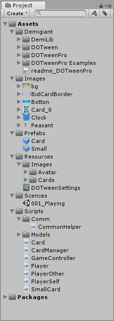
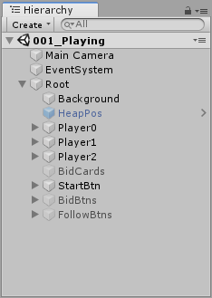
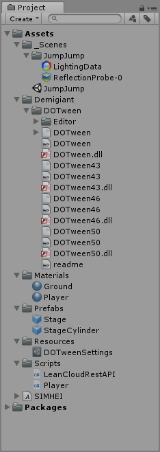
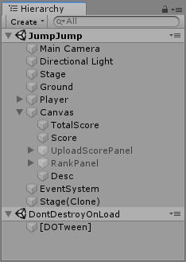
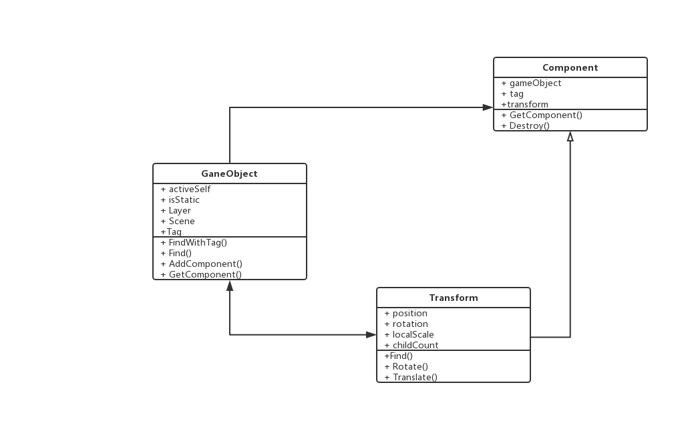
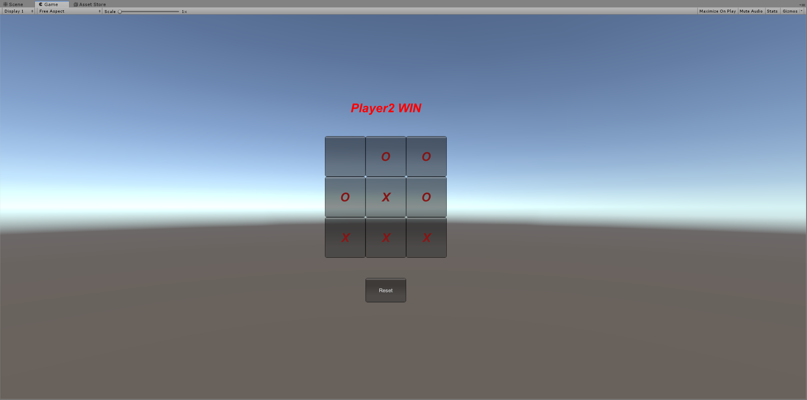

# Unity精简版双人井字棋

> 视频链接：<https://www.bilibili.com/video/av67336462/>
>
> 博客链接：<https://liangwj45.github.io/2019/09/11/Unity3D精简版双人井字棋/>

## 一、简答题

### 1.  解释游戏对象（GameObjects）和资源（Assets）的区别与联系。

- 资源（Asset）是硬盘中的文件，存储在Unity工程的Assets文件夹内。例如，纹理（Texture），材质（Material）和FBX文件等，它们都是资源。一些资源的数据格式是Unity原生支持的，例如材质。有些资源则需要转换为原生的数据格式后才能被Unity使用，例如FBX文件。
- 对象代表序列化数据的集合，表示某个资源的具体实例。它可以是Unity引擎使用的任何类型的资源，例如网格，Sprite，音频剪辑或动画剪辑。所有的对象（Object）都是UnityEngine.Object基类的子类。
- 资源与对象是一种一对多的关系，即一个资源文件可能会包括多个对象。

### 2. 下载几个游戏案例，分别总结资源、对象组织的结构（指资源的目录组织结构与游戏对象树的层次结构）

- 斗地主游戏

  - 资源结构

  

  - 对象结构

  

- 跳一跳游戏

  - 资源结构

  

  - 对象结构

  

- 总结
  - 资源结构：都会有场景、素材、预设、脚本等目录
  - 对象结构：都会有相机、灯光、背景以及一个用于加载脚本的空对象等

### 3. 编写一个代码，使用 debug 语句来验证 MonoBehaviour 基本行为或事件触发的条件

- 基本行为包括 Awake() Start() Update() FixedUpdate() LateUpdate()

- 常用事件包括 OnGUI() OnDisable() OnEnable()

```c#
using System.Collections;
using System.Collections.Generic;
using UnityEngine;

public class NewBehaviourScript : MonoBehaviour {
    void Awake() {
        Debug.Log ("Awake");
    }
    void Start () {
        Debug.Log ("Start");
    }
    void Update () {
        Debug.Log ("Update");
    }
    void FixedUpdate() {
        Debug.Log ("FixedUpdate");
    }
    void LateUpdate() {
        Debug.Log ("LateUpdate");
    }
    void OnGUI() {
        Debug.Log ("GUI");
    }
    void Reset() {
        Debug.Log ("Reset");
    }
    void OnDisable() {
        Debug.Log ("Disable");
    }
    void OnDestroy() {
        Debug.Log ("Destroy");
    }
}
```

### 4. 查找脚本手册，了解 GameObject，Transform，Component 对象

- 分别翻译官方对三个对象的描述（Description）

  - GameObject：Unity场景中所有实例的基类。
  - Transform：对象的位置改变，旋转和缩放。
  - Component：附着在GameObject上所有事物的基类。

- 描述下图中 table 对象（实体）的属性、table 的 Transform 的属性、 table 的部件

  

  对象属性：

  - Cube

  Transform属性：

  - Position: (0, 0, 0)
  - Rotation: (0, 0, 0)
  - Scale: (1, 1, 1)

  部件：

  - Mesh Renderer

- 用 UML 图描述 三者的关系

  

### 5. 整理相关学习资料，编写简单代码验证以下技术的实现：

  - 查找对象
    - 通过名字查找

      ```c#
      public static GameObject Find(string name)；
      ```

    - 通过标签查找单个对象

      ```c#
      public static GameObject FindWithTag(string tag)；
      ```

    - 通过标签查找多个对象

      ```c#
      public static GameObject[] FindGameObjectsWithTag(string tag)；
      ```

  - 添加对象

    ```c#
    public static GameObect CreatePrimitive(PrimitiveTypetype)；
    ```

  - 遍历对象树

    ```c#
    foreach (Transform child in transform)；
    ```

  - 清除所有子对象：

    ```c#
    foreach (Transform child in transform) { Destroy(child.gameObject)；
    ```

### 6. 资源预设（Prefabs）与 对象克隆 (clone)

  - 预设（Prefabs）有什么好处？

    所有由预设生成的对象其属性会随着预设的改变而改变，方便统一批量调整对象属性。

  - 预设与对象克隆 (clone or copy or Instantiate of Unity Object) 关系？

    预设与克隆都能创建出相同的对象。预设与实例化的对象有关联，而对象克隆本体和克隆出的对象是不相影响的。

  - 制作 table 预制，写一段代码将 table 预制资源实例化成游戏对象

    ```c#
    public class NewBehaviourScript : MonoBehaviour {
        private void Start() {
            GameObject table = Instantiate(table_prefab, new Vector3(0, 0, 0));
        }
    }
    ```

## 二、编程实践，小游戏



博客地址：<https://liangwj45.github.io/2019/09/11/Unity3D精简版双人井字棋/>

核心代码：

```c#
using UnityEngine;

public class Main :MonoBehaviour {
    private int[,] check = new int[3, 3]; // 记录胜负情况
    private int[,] map = new int[3, 3]; // 记录棋子信息
    public int turn = 1, count = 0, win = 0;

    void Start() {
        turn = 1; count = 0; win = 0;
        for (int i = 0; i < 3; ++i)
            for (int j = 0; j < 3; ++j) {
                check[i, j] = 0; map[i, j] = 0;
            }
    }

    private void OnGUI() {
        if (GUI.Button(new Rect(900, 650, 100, 60), "Reset")) Start();

        GUIStyle style = new GUIStyle();
        style.fontSize = 30;
        style.alignment = TextAnchor.MiddleCenter;
        style.fontStyle = FontStyle.BoldAndItalic;
        style.normal.textColor = Color.red;

        if (win == 1) GUI.Label(new Rect(900, 180, 100, 100), "Player1 WIN", style);
        else if (win == 2) GUI.Label(new Rect(900, 180, 100, 100), "Player2 WIN", style);
        else if (win == 3) GUI.Label(new Rect(900, 180, 100, 100), "TIE", style);

        for (int i = 0; i < 3; ++i) {
            for (int j = 0; j < 3; ++j) {
                if (map[i, j] == 1) GUI.Button(new Rect(i * 100 + 800, j * 100 + 300, 100, 100), "O", style: style);
                else if (map[i, j] == -1) GUI.Button(new Rect(i * 100 + 800, j * 100 + 300, 100, 100), "X", style: style);
                if (GUI.Button(new Rect(i * 100 + 800, j * 100 + 300, 100, 100), "")) {
                    if (win > 0) return;
                    if (System.Math.Abs((check[0, i] += turn)) == 3) win = turn > 0 ? 1 : 2;
                    if (System.Math.Abs((check[1, j] += turn)) == 3) win = turn > 0 ? 1 : 2;
                    if (i == j && System.Math.Abs((check[2, 0] += turn)) == 3) win = turn > 0 ? 1 : 2;
                    if (i + j == 2 && System.Math.Abs((check[2, 1] += turn)) == 3) win = turn > 0 ? 1 : 2;
                    if (win == 0 && ++count == 9) win = 3;
                    map[i, j] = turn; turn = -turn;
                }
            }
        }
    }
}
```

