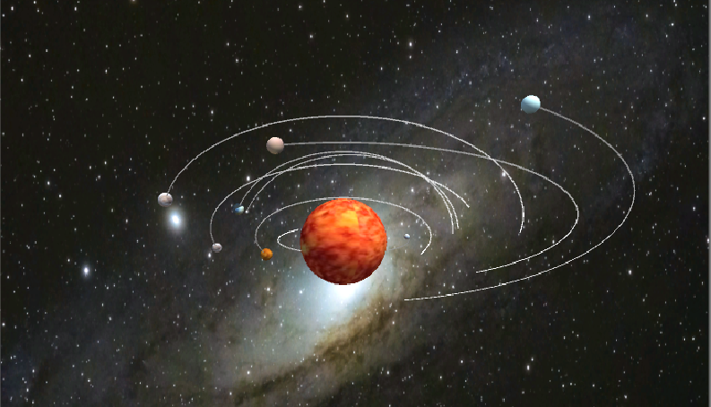

# HW3：空间与运动

## 1、简答并用程序验证

- 游戏对象运动的本质是什么？

  使用矩阵变换（平移、旋转、缩放）改变游戏对象的空间属性。

  ```c#
  // 平移
  public class Translate :MonoBehaviour {
      public int speed = 2;
      void Update() {
  		this.transform.Translate(speed * Vector3.forward * Time.deltaTime);
      }
  }
  // 旋转
  public class Rotating :MonoBehaviour {
      public float x, y, z;
      void Update() {
          this.transform.Rotate(x, y, z, Space.Self);
          //this.transform.Rotate(x, y, z, Space.World);
      }
  }
  // 缩放
  public class Zooming :MonoBehaviour {
      void Update() {
          float x = Input.GetAxis("Horizontal") * Time.deltaTime;           
          float z = Input.GetAxis("Vertical") * Time.deltaTime;
          this.transform.localScale += new Vector3(x, 0, z);
      }
  }
  ```

- 请用三种方法以上方法，实现物体的抛物线运动。（如，修改Transform属性，使用向量Vector3的方法…）

  - 方法一：直接改变物体的Position：$Y= X^2$

    ```c#
    public class Move :MonoBehaviour {
        public int speed = 2;
        void Start() {
            transform.position = new Vector3(-4, 16, 0);
        }
        void Update() {
            transform.position += speed * Vector3.right * Time.deltaTime;
            transform.position = new Vector3(transform.position.x, transform.position.x * transform.position.x, 0);
        }
    }
    ```

  - 方法二：通过给定X轴方向的移动速度及Y轴方向上的初始加速度，及初始速度。

    ```c#
    public class Move :MonoBehaviour {
        public float xspeed = 3;
        public float yspeed = -3;
        public int a = 1;
        void Update() {
            yspeed += a * Time.deltaTime;
            transform.Translate(xspeed * Vector3.right * Time.deltaTime);
            transform.Translate(yspeed * Vector3.up * Time.deltaTime);
        }
    }
    ```

  - 方法三：通过设置刚体属性，并给予物体重力加速度和初始速度。

    ```c#
    public class Move :MonoBehaviour {
        void Start() {
            transform.position = new Vector3(-4, 16, 0);
        }
        void Update() {
            Rigidbody rbd = this.gameObject.AddComponent<Rigidbody>();
            rbd.useGravity = true;
            rbd.velocity = Vector3.right * 5;
        }
    }
    ```


## 2、编程实践

### 太阳系

博客地址：

视频链接：



### 牧师与魔鬼

博客地址：


