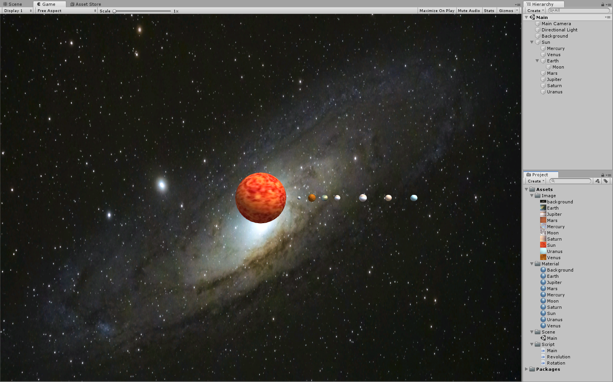

# 太阳系

项目地址：

视频链接：

### 添加对象与贴图

添加太阳和各行星的对象，并为其添加样式，添加背景。



### 编写实现公转代码

编写 `Revolution` 类，`Revolution` 类具有三个属性，围绕 `center` 进行旋转。

- `center`：公转的中心
- `plane`：旋转平面
- `speed`：旋转速度

```c#
using System.Collections;
using System.Collections.Generic;
using UnityEngine;

public class Revolution :MonoBehaviour {
    public GameObject center;
    public Vector3 plane = new Vector3(0, 1, 0);
    public float speed = 50;
    void Update() {
        this.transform.RotateAround(center.transform.position, plane, speed * Time.deltaTime);
    }
}
```

### 编写实现自转代码

编写 `Rotation` 类，`Rotation` 类具有一个属性，围绕自身进行旋转。

- `plane`：旋转平面

- `speed`：旋转速度

```c#
using System.Collections;
using System.Collections.Generic;
using UnityEngine;

public class Rotation :MonoBehaviour {
    public Vector3 plane = new Vector3(0, 1, 0);
    public int speed = 10;
    void Update() {
        this.transform.RotateAround(this.transform.position, plane, speed * Time.deltaTime);
    }
}
```

### 将代码绑定到对象上

首先在 `Start` 方法中找到本对象的子对象，然后依次给该子对象添加公转行为、运行轨迹和自转行为。

- AddRevolution：
  - 设置旋转中心；
  - 设置速度，速度设置为与自身位置相关的一个值，由于各行星的初始位置不同，因此他们会获得不同的公转速度；
  - 设置旋转平面，定义一个随机生成的 Vector3 变量，由此可以获得一个随机的旋转平面。
- SetTrailRenderer：
  - 设置保留时间
  - 设置开始宽度和结束宽度
  - 设置颜色
- AddRotation：
  - 设置旋转平面

相关代码编写完毕后，将 `Main` 脚本添加到 `Sun` 对象和 `Earth` 对象上，然后将 `Rotation` 脚本添加到 `Sun` 对象上，即完成各行为与对象的绑定。

```c#
using System.Collections;
using System.Collections.Generic;
using UnityEngine;

public class Main :MonoBehaviour {
    void Start() {
        int i = transform.childCount;
        while (i-- > 0) {
            AddRevolution(transform.GetChild(i), transform.gameObject);
            SetTrailRenderer(transform.GetChild(i));
            AddRotation(transform.GetChild(i));
        }
    }

    private void AddRevolution(Transform trans, GameObject center) {
        GameObject obj = trans.gameObject;
        obj.AddComponent<Revolution>();
        Revolution r = obj.GetComponent<Revolution>();
        r.center = center;
        r.speed = 300 / obj.transform.position.x * Random.Range(1f, 1.5f);
        r.plane = new Vector3(0, Random.Range(0, 1000) / 10f, Random.Range(0, 1000) / 10f);
    }

    private void SetTrailRenderer(Transform trans) {
        GameObject obj = trans.gameObject;
        obj.AddComponent<TrailRenderer>();
        TrailRenderer tr = obj.GetComponent<TrailRenderer>();
        tr.time = 3;
        tr.startWidth = 0.1f;
        tr.endWidth = 0.1f;
        tr.material = new Material(Shader.Find("Sprites/Default"));
        float alpha = 1.0f;
        Gradient gradient = new Gradient();
        gradient.SetKeys(
            new GradientColorKey[] { new GradientColorKey(Color.grey, 0.0f), new GradientColorKey(Color.white, 1.0f) },
            new GradientAlphaKey[] { new GradientAlphaKey(alpha, 0.0f), new GradientAlphaKey(alpha, 1.0f) }
        );
        tr.colorGradient = gradient;
    }

    private void AddRotation(Transform trans) {
        GameObject obj = trans.gameObject;
        obj.AddComponent<Rotation>();
        Rotation r = obj.GetComponent<Rotation>();
        r.plane = obj.GetComponent<Revolution>().plane;
    }
}

```


### 运行程序

点击开始按钮，查看运行结果。

