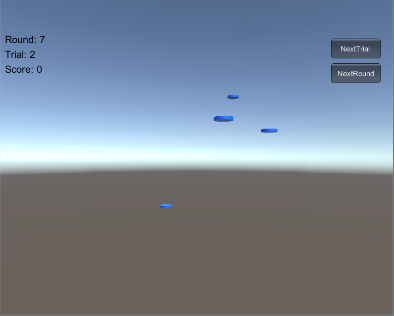

# HW5：鼠标打飞碟（Hit UFO）游戏

视频链接：<https://www.bilibili.com/video/av70662881/>

## 程序内容要求

- 游戏有 n 个 round，每个 round 都包括10 次 trial；
- 每个 trial 的飞碟的色彩、大小、发射位置、速度、角度、同时出现的个数都可能不同。它们由该 round 的 ruler 控制；
- 每个 trial 的飞碟有随机性，总体难度随 round 上升；
- 鼠标点中得分，得分规则按色彩、大小、速度不同计算，规则可自由设定。

## 游戏要求：

- 使用带缓存的工厂模式管理不同飞碟的生产与回收，该工厂必须是场景单实例的！具体实现见参考资源 Singleton 模板类
- 近可能使用前面 MVC 结构实现人机交互与游戏模型分离

## 游戏截图



## 编写程序

### 导演类（Director）

控制场景的切换。

```c#
public class Director :System.Object {
    private static Director instance;
    public ISceneController currentSceneController { get; set; }
    public bool running { get; set; }
    public int fps {
        get { return Application.targetFrameRate; }
        set { Application.targetFrameRate = value; }
    }

    public static Director GetInstance() {
        return instance ?? (instance = new Director());
    }

    public void OnSceneWake(ISceneController controller) {
        currentSceneController = controller;
        controller.LoadResources();
    }
}
```

### 飞碟对象类（UFO）

主要游戏对象。

```c#
public enum UFOState { Stop, Moving };
public class UFO :MonoBehaviour {
    public int score;
    public float speed = 0;
    public Vector3 direction { get; set; }
    public UFOState state;

    public void Update() {
        if (state == UFOState.Moving) {
            gameObject.transform.Translate(speed * direction * Time.deltaTime);
        } else {
            speed = 0;
        }
    }

    public void SetPosition(Vector3 position) {
        gameObject.transform.position = position;
    }

    private void OnBecameVisible() {
        state = UFOState.Moving;
    }

    private void OnBecameInvisible() {
        state = UFOState.Stop;
    }
}
```

### 规则类（Rule）

规定游戏中积分与难度变化。

```c#
public class Ruler {
    private readonly int currentRound;
    private System.Random random;
    private static int[] UFOCount = { 1, 2, 2, 3, 3, 4, 4, 5, 5, 5 };
    private static int[] score = { 1, 2, 3 };
    private static string[] colors = { "Red", "Green", "Blue" };

    public Ruler(int currentRound) {
        this.currentRound = currentRound;
        this.random = new System.Random();
    }

    public int GetUFOCount() {
        return UFOCount[currentRound - 1];
    }

    public List<GameObject> GetUFOs() {
        List<GameObject> ufos = new List<GameObject>();
        var index = random.Next(3);
        var color = colors[index];
        var count = GetUFOCount();
        for (int i = 0; i < count; ++i) {
            Vector3 position = GetRandomPosition();
            var obj = UFOFactory.GetInstance().GetUFO(color);
            var ufo = obj.GetComponent<UFO>();
            ufo.SetPosition(position);
            ufo.score = score[index] * (currentRound + 1);
            ufo.speed = currentRound * 0.01f + 0.5f;
            ufo.state = UFOState.Moving;
            ufo.direction = GetRandomDirection();
            ufos.Add(obj);
        }

        return ufos;
    }

    private Vector3 GetRandomDirection() {
        int s1 = random.Next(2) < 1 ? -1 : 1;
        int s2 = random.Next(2) < 1 ? -1 : 1;
        int s3 = random.Next(2) < 1 ? -1 : 1;
        return new Vector3(RandomFloat(10) * s1, RandomFloat(10) * s2, RandomFloat(10) * s3);
    }

    private Vector3 GetRandomPosition() {
        return new Vector3(RandomFloat(1), RandomFloat(4), RandomFloat(1));
    }

    private float RandomFloat(int n) {
        return random.Next(n * 10) / 10.0f;
    }
}

```

### 工厂类（UFOFactory）

工厂方法，用于UFO对象的基础构建。

```c#
public class UFOFactory {
    private static UFOFactory factory;
    private List<GameObject> used = new List<GameObject>();
    private List<GameObject> pool = new List<GameObject>();
    private readonly Vector3 invisible = new Vector3(0, -100, 0);

    public static UFOFactory GetInstance() {
        return factory ?? (factory = new UFOFactory());
    }

    public GameObject GetUFO(string color) {
        GameObject obj;
        if (pool.Count == 0) {
            obj = Object.Instantiate(Resources.Load<GameObject>("Prefabs/UFO"), invisible, Quaternion.identity);
        } else {
            obj = pool[0];
            pool.RemoveAt(0);
        }

        Material material = Object.Instantiate(Resources.Load("Materials/" + color)) as Material;
        obj.GetComponent<MeshRenderer>().material = material;
        obj.AddComponent<UFO>();
        used.Add(obj);
        return obj;
    }

    public void Recycle(GameObject obj) {
        var ufo = obj.GetComponent<UFO>();
        ufo.SetPosition(invisible);
        ufo.state = UFOState.Stop;
        used.Remove(obj);
        pool.Add(obj);
    }
}
```

### 游戏模型类（SSActionManager）

规定游戏状态如何进行改变。

```c#
public enum SceneState { Waiting, Shooting }
public enum GameState { Running, Lose, Win }
public class GameModel
{

  public GameState gameState = GameState.Running;
  public SceneState sceneState = SceneState.Waiting;
  public EventHandler onRefresh;
  public EventHandler onEnterNextTrial;
  public readonly int maxRound = 10;
  public readonly int maxTrial = 10;
  public int currentRound { get; private set; } = 1;
  public int currentTrial { get; private set; } = 1;
  public int score { get; private set; } = 0;

  public void Restart()
  {
    gameState = GameState.Running;
    sceneState = SceneState.Waiting;
    currentRound = 1;
    currentTrial = 1;
    score = 0;
    onRefresh.Invoke(this, EventArgs.Empty);
    onEnterNextTrial.Invoke(this, EventArgs.Empty);
  }

  public void NextRound()
  {
    if (currentRound == maxRound)
    {
      gameState = GameState.Win;
    }
    else
    {
      currentRound++;
      onRefresh.Invoke(this, EventArgs.Empty);
      onEnterNextTrial.Invoke(this, EventArgs.Empty);
    }
  }

  public void NextTrial()
  {
    if (currentTrial == maxTrial)
    {
      currentTrial = 0;
      NextRound();
    }
    else
    {
      currentTrial++;
      onRefresh.Invoke(this, EventArgs.Empty);
      onEnterNextTrial.Invoke(this, EventArgs.Empty);
    }
  }

  public void AddScore(int score)
  {
    this.score += score;
    onRefresh.Invoke(this, EventArgs.Empty);
  }

  public void SubScore()
  {
    this.score -= 8 * currentRound;
    if (score < 0)
    {
      gameState = GameState.Lose;
    }
    onRefresh.Invoke(this, EventArgs.Empty);
  }
}
```

### 接口类（Interface）

```c#
public interface ISceneController {
    void LoadResources();
}
```

### 场景控制类（MainSceneController）

游戏主要逻辑控制，负责游戏的开始和结束相应操作的执行。

```c#
public class MainSceneController : MonoBehaviour, ISceneController
{
  private GameModel model = new GameModel();
  private GameGUI gameGUI;
  private Ruler ruler;

  private List<GameObject> UFOs = new List<GameObject>();

  void Awake()
  {
    Director.GetInstance().OnSceneWake(this);
    gameGUI = gameObject.AddComponent<GameGUI>();
    gameGUI.onPressRestartButton += delegate
    {
      model.Restart();
    };
    gameGUI.onPressNextRoundButton += delegate
    {
      if (model.gameState == GameState.Running)
      {
        model.NextRound();
      }
    };
    gameGUI.onPressNextTrialButton += delegate
    {
      if (model.gameState == GameState.Running)
      {
        model.NextTrial();
      }
    };
    ruler = new Ruler(model.currentRound);
    model.onRefresh += delegate
    {
      gameGUI.state = model.gameState;
      gameGUI.round = model.currentRound;
      gameGUI.trial = model.currentTrial;
      gameGUI.score = model.score;
      if (model.gameState == GameState.Lose)
      {
        DestroyAll();
      }
    };
    model.onEnterNextTrial += delegate
    {
      ruler = new Ruler(model.currentRound);
    };
  }

  void Update()
  {
    for (int i = 0; i < UFOs.Count; i++)
    {
      if (UFOs[i].GetComponent<UFO>().speed == 0)
      {
        OnMissUFO(UFOs[i].gameObject);
      }
    }

    if (model.gameState == GameState.Running)
    {
      if (model.sceneState == SceneState.Shooting && Input.GetButtonDown("Fire1"))
      {
        Ray ray = Camera.main.ScreenPointToRay(Input.mousePosition);
        if (Physics.Raycast(ray, out RaycastHit hit) && hit.collider.gameObject.tag == "UFO")
        {
          OnHitUFO(hit.collider.gameObject);
        }
      }

      if (model.sceneState == SceneState.Waiting && Input.GetKeyDown("space"))
      {
        model.sceneState = SceneState.Shooting;
        model.NextTrial();
        if (model.gameState == GameState.Win)
        {
          return;
        }
        UFOs.AddRange(ruler.GetUFOs());
      }

      if (UFOs.Count == 0)
      {
        model.sceneState = SceneState.Waiting;
      }
    }
  }

  public void LoadResources() { }

  private void OnHitUFO(GameObject ufo)
  {
    model.AddScore(ufo.GetComponent<UFO>().score);
    DestroyUFO(ufo);
  }

  private void OnMissUFO(GameObject ufo)
  {
    model.SubScore();
    DestroyUFO(ufo);
  }

  private void DestroyUFO(GameObject ufo)
  {
    UFOs.Remove(ufo);
    UFOFactory.GetInstance().Recycle(ufo);
  }

  private void DestroyAll()
  {
    for (int i = 0; i < UFOs.Count; i++)
    {
      UFOFactory.GetInstance().Recycle(UFOs[i]);
    }
    UFOs.Clear();
  }
}
```

### UI类（GameGUI）

控制界面中文字和按钮的显示，处理游戏状态改变对应UI的相应变化。

```c#
public class GameGUI :MonoBehaviour {
    public GameState state;
    public int round = 0;
    public int trial = 0;
    public int score = 0;

    public EventHandler onPressRestartButton;
    public EventHandler onPressNextRoundButton;
    public EventHandler onPressNextTrialButton;

    void OnGUI() {
        var textStyle = new GUIStyle() {
            fontSize = 20
        };

        GUI.Label(new Rect(10, Screen.height / 2 - 250, 200, 100), "Round: " + round, textStyle);
        GUI.Label(new Rect(10, Screen.height / 2 - 220, 200, 100), "Trial: " + trial, textStyle);
        GUI.Label(new Rect(10, Screen.height / 2 - 190, 200, 100), "Score: " + score, textStyle);

        if (state != GameState.Running) {
            var text = state == GameState.Win ? "You Win!" : "You Lose!";
            GUI.Label(new Rect(Screen.width / 2 - 50, Screen.height / 2 - 50, 100, 50), text, new GUIStyle() { fontSize = 40, alignment = TextAnchor.MiddleCenter });
            if (GUI.Button(new Rect(Screen.width / 2 - 70, Screen.height / 2, 140, 70), "Restart", new GUIStyle("button") { fontSize = 30 })) {
                onPressRestartButton.Invoke(this, EventArgs.Empty);
            }
        }

        if (GUI.Button(new Rect(Screen.width - 125, Screen.height - 510, 100, 40), "NextRound", new GUIStyle("button") { fontSize = 15, alignment = TextAnchor.MiddleCenter })) {
            onPressNextRoundButton.Invoke(this, EventArgs.Empty);
        }

        if (GUI.Button(new Rect(Screen.width - 125, Screen.height - 560, 100, 40), "NextTrial", new GUIStyle("button") { fontSize = 15, alignment = TextAnchor.MiddleCenter })) {
            onPressNextTrialButton.Invoke(this, EventArgs.Empty);
        }
    }
}
```

