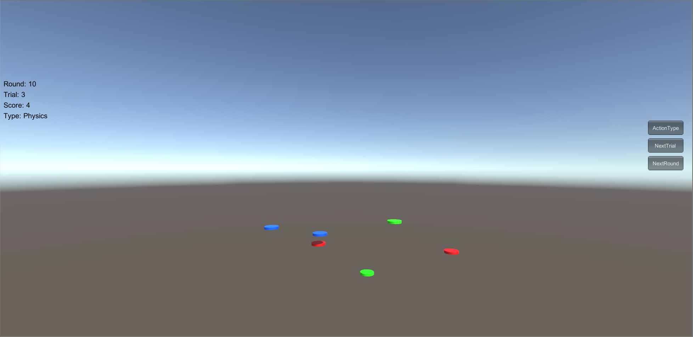
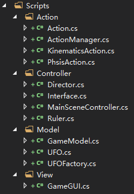

# HW5：鼠标打飞碟游戏（物理版）

视频链接：<https://www.bilibili.com/video/av71602404/>

## 程序内容要求

- 按 *adapter模式* 设计图修改飞碟游戏
- 添加物理运动与运动学（变换）运动模式的切换。

## 游戏要求

- 游戏有 n 个 round，每个 round 都包括10 次 trial；
- 每个 trial 的飞碟的色彩、大小、发射位置、速度、角度、同时出现的个数都可能不同。它们由该 round 的 ruler 控制；
- 每个 trial 的飞碟有随机性，总体难度随 round 上升；
- 鼠标点中得分，得分规则按色彩、大小、速度不同计算，规则可自由设定。

## 游戏截图



## 编写程序

上次作业由于时间有限，没有将对象的运动与对象本身分离，而上次使用的是运动学方法的运动，这次添加物理学方法的运动。

### 项目的目录结构




### Model

#### 飞碟对象类（UFO）

简化了游戏对象类的实现，只保留分数和对象是否可见属性。

```c#
public class UFO :MonoBehaviour {
    public int score;
    public bool visible = false;

    private void OnBecameVisible() {
        visible = true;
    }

    private void OnBecameInvisible() {
        visible = false;
    }
}
```

#### 工厂类（UFOFactory）

工厂方法，用于UFO对象的基础构建。主要是添加了对运动方法的判断，如果是物理方法，则给对象添加刚体组件。

```c#
public class UFOFactory {
    public GameObject GetUFO(string color) {
        GameObject obj;
        // some code
        if (type == ActionType.Physics) {
            obj.AddComponent<Rigidbody>();
        }
        // some code
        return obj;
    }
}
```

#### 游戏模型类（GameModel）

规定游戏状态如何进行改变。主要添加了修改运动模式的方法，以及完善了原来的代码逻辑。

```c#
public class GameModel {
    public ActionType type = ActionType.Kinematics;
    
    public void ChangeActionType() {
        type = type == ActionType.Physics ? ActionType.Kinematics : ActionType.Physics;
        onRefresh.Invoke(this, EventArgs.Empty);
    }
}
```

### View

#### UI类（GameGUI）

控制界面中文字和按钮的显示，处理游戏状态改变对应UI的相应变化。主要添加了运动模式的文字说明以及切换运动模式的按钮。

```c#
public class GameGUI :MonoBehaviour {
    public string type = "Kinematics";
    public EventHandler onPressActionTypeButton;

    void OnGUI() {
        GUI.Label(new Rect(10, Screen.height / 2 - 160, 200, 100), "Type: " + type, textStyle);

        if (GUI.Button(new Rect(Screen.width - 125, Screen.height - 610, 100, 40), "ActionType", new GUIStyle("button") { fontSize = 15, alignment = TextAnchor.MiddleCenter })) {
            onPressActionTypeButton.Invoke(this, EventArgs.Empty);
        }
    }
}
```

### Controller

#### 规则类（Rule）

规定游戏中积分与难度变化。主要修改了给对象添加运动的实现。

```c#
using System.Collections.Generic;
using UnityEngine;

public class Ruler {
    public ActionManager actionManager

    public List<GameObject> GetUFOs(int round, ActionType type) {
        List<GameObject> ufos = new List<GameObject>();
        var count = GetUFOCount(round);

        for (int i = 0; i < count; ++i) {
            var index = random.Next(3);
            var obj = factory.GetUFO(colors[index], type);
            obj.transform.position = GetRandomPosition();

            var ufo = obj.GetComponent<UFO>();
            ufo.score = GetScore(round, index);
            ufo.visible = true;
            
			// 给对象添加运动，并将运动添加到actionManager的运动列表中
            var speed = GetSpeed(round);
            var direction = GetRandomDirection(type);
            if (type == ActionType.Kinematics) {
                KinematicsAction action = KinematicsAction.GetAction(direction, speed);
                actionManager.AddAction(obj, action);
            } else {
                PhysicsAction action = PhysicsAction.GetAction(direction, speed);
                actionManager.AddAction(obj, action);
            }

            ufos.Add(obj);
        }
        return ufos;
    }
}
```

#### 场景控制类（MainSceneController）

游戏主要逻辑控制，负责游戏的开始和结束相应操作的执行。主要为添加物理运动的支持以及代码逻辑的完善，去除了 Destroy 方法，修复了对象被重复“销毁”的 bug。

```c#
public class MainSceneController :MonoBehaviour, ISceneController {
    private List<GameObject> UFOs = new List<GameObject>();
    private GameModel model = new GameModel();
    private GameGUI gameGUI;
    private Ruler ruler;

    void Awake() {
        ruler = new Ruler();
        ruler.actionManager = gameObject.AddComponent<ActionManager>();
        gameGUI = gameObject.AddComponent<GameGUI>();
        gameGUI.onPressRestartButton += delegate {
            DestroyAll();
            model.Restart();
        };
        gameGUI.onPressNextRoundButton += delegate {
            if (model.gameState == GameState.Running) {
                model.NextRound();
            }
        };
        gameGUI.onPressNextTrialButton += delegate {
            if (model.gameState == GameState.Running) {
                model.NextTrial();
            }
        };
        gameGUI.onPressActionTypeButton += delegate {
            model.ChangeActionType();
        };
        model.onRefresh += delegate {
            gameGUI.state = model.gameState;
            gameGUI.round = model.currentRound;
            gameGUI.trial = model.currentTrial;
            gameGUI.score = model.score;
            gameGUI.type = model.type == ActionType.Physics ? "Physics" : "Kinematics";
            if (model.gameState != GameState.Running) {
                DestroyAll();
            }
        };
        Director.GetInstance().OnSceneWake(this);
    }

    void Update() {
        if (model.gameState == GameState.Running) {
            if (model.sceneState == SceneState.Shooting) {
                if (Input.GetButtonDown("Fire1")) {
                    Ray ray = Camera.main.ScreenPointToRay(Input.mousePosition);
                    if (Physics.Raycast(ray, out RaycastHit hit) && hit.collider.gameObject.tag == "UFO") {
                        OnHitUFO(hit.collider.gameObject);
                    }
                }

                for (int i = 0; i < UFOs.Count; i++) {
                    if (!UFOs[i].GetComponent<UFO>().visible) {
                        OnMissUFO(UFOs[i].gameObject);
                    }
                }

                if (UFOs.Count == 0 && model.gameState == GameState.Running) {
                    model.sceneState = SceneState.Waiting;
                    model.NextTrial();
                }
            } else {
                if (Input.GetKeyDown("space")) {
                    UFOs = ruler.GetUFOs(model.currentRound, model.type);
                    model.sceneState = SceneState.Shooting;
                }
            }
        }
    }

    public void LoadResources() { }

    private void OnHitUFO(GameObject ufo) {
        UFOs.Remove(ufo);
        UFOFactory.GetInstance().Recycle(ufo);
        model.AddScore(ufo.GetComponent<UFO>().score);
    }

    private void OnMissUFO(GameObject ufo) {
        UFOs.Remove(ufo);
        UFOFactory.GetInstance().Recycle(ufo);
        model.SubScore(ruler.GetSubScore(model.currentRound));
    }

    private void DestroyAll() {
        for (int i = 0; i < UFOs.Count; i++) {
            UFOFactory.GetInstance().Recycle(UFOs[i]);
        }
        UFOs.Clear();
    }
}
```

### Action

#### 运动方法基类（Action）

定义运动方法属性。

```c#
public enum ActionType { Physics, Kinematics };  // 物理方法、运动学方法

public class Action :ScriptableObject {
    public GameObject gameObject;
    public Vector3 direction;
    public float speed = 0;
    public bool destroy = false;
    public bool enable = true;

    public virtual void Start() {
        throw new System.NotImplementedException();
    }

    public virtual void Update() {
        throw new System.NotImplementedException();
    }
}
```

#### 物理方法运动类（PhysicsAction）

定义运动获取方法以及运动方法的实现。

```c#
public class PhysicsAction :Action {
    public static PhysicsAction GetAction(Vector3 direction, float speed) {
        PhysicsAction action = ScriptableObject.CreateInstance<PhysicsAction>();
        action.direction = direction;
        action.speed = speed;
        action.destroy = false;
        action.enable = true;
        return action;
    }

    public override void Update() {
        if (gameObject.GetComponent<UFO>().visible) {
            gameObject.transform.Translate(speed * direction * Time.deltaTime);
        } else {
            Destroy(gameObject.GetComponent<Rigidbody>());
            destroy = true;
            enable = false;
        }
    }

    public override void Start() { }
}
```

#### 运动学方法运动类（KinematicsAction）

定义运动获取方法以及运动方法的实现。

```c#
public class KinematicsAction :Action {
    public static KinematicsAction GetAction(Vector3 direction, float speed) {
        KinematicsAction action = ScriptableObject.CreateInstance<KinematicsAction>();
        action.direction = direction;
        action.speed = speed;
        action.destroy = false;
        action.enable = true;
        return action;
    }

    public override void Update() {
        if (gameObject.GetComponent<UFO>().visible) {
            gameObject.transform.Translate(speed * direction * Time.deltaTime);
        } else {
            speed = 0;
            destroy = true;
            enable = false;
        }
    }

    public override void Start() { }
}
```

#### 运动管理类（ActionManager）

定义运动的执行和移除。

```c#
public class ActionManager :MonoBehaviour {
    private List<Action> actions = new List<Action>();
    private List<Action> add_list = new List<Action>();
    private List<Action> delete_list = new List<Action>();

    protected void Update() {
        foreach (Action ac in add_list) {
            actions.Add(ac);
        }
        add_list.Clear();

        foreach (Action ac in actions) {
            if (ac.destroy) {
                delete_list.Add(ac);
            } else if (ac.enable) {
                ac.Update();
            }
        }

        foreach (Action ac in delete_list) {
            actions.Remove(ac);
        }

        delete_list.Clear();
    }

    public void AddAction(GameObject gameObject, Action action) {
        action.gameObject = gameObject;
        add_list.Add(action);
        action.Start();
    }
}
```

很多优化的代码细节没有展示出来，可以通过项目仓库查看源码。


