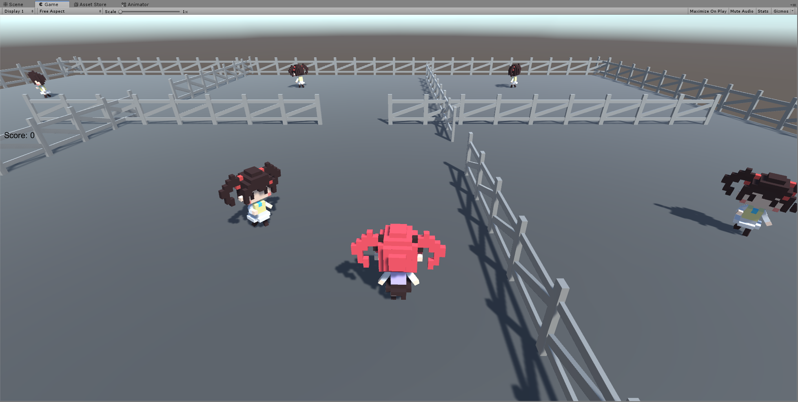

# 巡逻兵

视频链接：<https://www.bilibili.com/video/av74253695/>

## 游戏设计要求

- 创建一个地图和若干巡逻兵(使用动画)；
- 每个巡逻兵走一个3~5个边的凸多边型，位置数据是相对地址。即每次确定下一个目标位置，用自己当前位置为原点计算；
- 巡逻兵碰撞到障碍物，则会自动选下一个点为目标；
- 巡逻兵在设定范围内感知到玩家，会自动追击玩家；
- 失去玩家目标后，继续巡逻；
- 计分：玩家每次甩掉一个巡逻兵计一分，与巡逻兵碰撞游戏结束；

## 游戏截图



## 编写程序

### Map

先在Unity上创建游戏地图以及游戏对象的预制，如栏杆，地板，游戏角色等。

然后用代码控制地图的生成以及游戏对象的放置。

```c#
using UnityEngine;

public class Map :Object {
    private static GameObject planePrefab = Resources.Load<GameObject>("Prefabs/Plane");
    private static GameObject fencePrefab = Resources.Load<GameObject>("Prefabs/Fence");
    private static GameObject triggerPrefab = Resources.Load<GameObject>("Prefabs/Trigger");

    public void LoadMap() {
        LoadPlane();
        LoadFences();
        LoadWalls();
        LoadTriggers();
    }

    public void LoadPlane() {
        GameObject plane = Instantiate(planePrefab);
        plane.transform.position = new Vector3(0, 0, 0);
    }

    public void LoadFences() {
        int[,] exist = { { 0, 0, 1, 1, 1, 1, 1, 1, 1, 1, 1, 0, 0, 1, 1, 1, 1, 1, 1, 0, 0, 1, 1, 1, 1, 1, 1, 1 }, { 1, 1, 1, 1, 1, 0, 0, 1, 1, 1, 1, 1, 1, 1, 1, 0, 0, 1, 1, 1, 1, 1, 1, 1, 1, 1, 0, 0 } };
        for (int i = -13; i <= 14; i++) {
            for (int j = 0; j <= 1; j++) {
                if (exist[j, i + 13] == 1) {
                    GameObject fence1 = Instantiate(fencePrefab);
                    fence1.transform.position = new Vector3(10 * j - 5, 0, (i - 1) * 1.1f);
                    fence1.transform.rotation = Quaternion.Euler(0, 90, 0);
                }
                if (exist[j, i + 13] == 1) {
                    GameObject fence2 = Instantiate(fencePrefab);
                    fence2.transform.position = new Vector3(i * 1.1f, 0, 10 * j - 5);
                    fence2.transform.rotation = Quaternion.Euler(0, 0, 0);
                }
            }
        }
    }

    public void LoadWalls() {
        for (int i = -13; i <= 14; i++) {
            for (int j = 0; j <= 1; j++) {
                GameObject fence1 = Instantiate(fencePrefab);
                fence1.transform.position = new Vector3(30 * j - 15, 0, (i - 1) * 1.1f);
                fence1.transform.rotation = Quaternion.Euler(0, 90, 0);
                GameObject fence2 = Instantiate(fencePrefab);
                fence2.transform.position = new Vector3(i * 1.1f, 0, 30 * j - 15);
                fence2.transform.rotation = Quaternion.Euler(0, 0, 0);
            }
        }
    }

    public void LoadTriggers() {
        for (int i = -10, index = 0; i <= 10; i += 10) {
            for (int j = -10; j <= 10; j += 10) {
                GameObject trigger = Instantiate(triggerPrefab);
                trigger.transform.position = new Vector3(i, 0, j);
                AreaCollider collider = trigger.AddComponent<AreaCollider>();
                collider.sign = ++index;
                trigger.name = "Trigger" + index;
            }
        }
    }
}
```

### TracertAction

添加运动类，相比之前的MoveToAction，多加了一个TracertAction，即追随Target进行移动的方法。

```c#
using UnityEngine;

public class TracertAction :Action {
    public GameObject target;
    public float speed;

    private TracertAction() { }

    public static TracertAction GetAction(GameObject target, float speed) {
        TracertAction action = ScriptableObject.CreateInstance<TracertAction>();
        action.target = target;
        action.speed = speed;
        return action;
    }

    public override void Update() {
        Quaternion rotation = Quaternion.LookRotation(target.transform.position - gameObject.transform.position, Vector3.up);
        gameObject.transform.position = Vector3.MoveTowards(gameObject.transform.position, target.transform.position, speed * Time.deltaTime);
        gameObject.transform.rotation = rotation;
        if (gameObject.transform.position == target.transform.position) {
            destroy = true;
        }
    }

    public override void Start() { }
}
```

### GameActionManager

添加运动管理类，对巡逻兵的运动进行统一的管理，控制其巡逻或者追捕。

```c#
using System.Collections.Generic;
using UnityEngine;

public class GameActionManager :ActionManager, IActionCallback {
    public GameObject player;
    public Dictionary<int, GameObject> props;
    public Dictionary<int, Action> tracert = new Dictionary<int, Action>();
    public Dictionary<int, Action> moveAround = new Dictionary<int, Action>();
    public float speed = 2f;
    public int room;
    public static System.Random rand = new System.Random();

    public void AddPropMoves(int sign) {
        room = sign;
        for (int i = 1; i <= 9; i++) {
            if (i == sign) {
                tracert.Add(i, Tracert(props[i]));
            } else {
                moveAround.Add(i, MoveAround(props[i], i));
            }
        }
    }

    public void SetPlayerArea(int sign) {
        tracert[room].destroy = true;
        tracert.Remove(room);
        moveAround[room] = MoveAround(props[room], room);
        room = sign;
        moveAround[room].destroy = true;
        moveAround.Remove(room);
        tracert[room] = Tracert(props[room]);
    }

    public Action MoveAround(GameObject prop, int sign) {
        Vector3 position = new Vector3((sign - 1) / 3 * 10 - 10, 0, (sign - 1) % 3 * 10 - 10);
        Action action1 = MoveToAction.GetAction(new Vector3(position.x - 2f, 0, position.z - 2f), speed);
        Action action2 = MoveToAction.GetAction(new Vector3(position.x - 2f, 0, position.z + 2f), speed);
        Action action3 = MoveToAction.GetAction(new Vector3(position.x + 2f, 0, position.z + 2f), speed);
        Action action4 = MoveToAction.GetAction(new Vector3(position.x + 2f, 0, position.z - 2f), speed);
        Action sequence = SequenceAction.GetAction(-1, 0, speed, new List<Action> { action1, action2, action3, action4 });
        AddAction(prop, sequence, this);
        return sequence;
    }

    public Action Tracert(GameObject prop) {
        Action action = TracertAction.GetAction(player, speed);
        AddAction(prop, action, this);
        return action;
    }

    public void IActionCallback(Action action) {

    }
}
```

### PropFactory

巡逻兵的生产工厂。

```c#
using System.Collections.Generic;
using UnityEngine;

public class PropFactory {
    private static PropFactory instance = new PropFactory();
    private Dictionary<int, GameObject> props = new Dictionary<int, GameObject>();
    private GameObject propPrefabs = Resources.Load<GameObject>("Prefabs/Prop");
    private int props_count = 9;

    private PropFactory() { }

    public static PropFactory GetInstance() {
        return instance ?? (instance = new PropFactory());
    }

    public Dictionary<int, GameObject> GetProps() {
        if (props.Count == props_count) return props;
        int index = 0;
        for (int i = -10; i <= 10; i += 10) {
            for (int j = -10; j <= 10; j += 10) {
                GameObject prop = Object.Instantiate(propPrefabs);
                prop.transform.position = new Vector3(i, 0, j);
                prop.name = "Prop" + (++index);
                prop.AddComponent<PlayerCollider>();
                props.Add(index, prop);
            }
        }
        return props;
    }

    public void ResetAll() {
        if (props.Count < props_count) GetProps();
        for (int i = -10, index = 0; i <= 10; i += 10) {
            for (int j = -10; j <= 10; j += 10) {
                props[++index].transform.position = new Vector3(i, 0, j);
            }
        }
    }
}
```

### Collider

碰撞相关的类，包括控制玩家进入方格，当前方格的切换，以及巡逻兵与玩家碰撞后游戏状态的改变。

```c#
public class AreaCollider :MonoBehaviour {
    MainSceneController sceneController;
    public int sign = 0;

    void Start() {
        sceneController = Director.GetInstance().currentSceneController as MainSceneController;
    }

    void OnTriggerEnter(Collider collider) {
        if (collider.gameObject.tag == "Player") {
            sceneController.SetPlayerArea(sign);
            GameModel.GetInstance().PlayerEscape();
        }
    }
}

public class PlayerCollider :MonoBehaviour {
    void OnCollisionEnter(Collision other) {
        if (other.gameObject.tag == "Player") {
            GameModel.GetInstance().GameOver();
        }
    }
}
```

### MainSceneController

游戏主体逻辑控制类。

```c#
using System.Collections.Generic;
using UnityEngine;

public class MainSceneController :MonoBehaviour, ISceneController {
    private GameActionManager actionManager;
    private GameGUI gameGUI;
    private GameModel model;
    private GameObject player;
    private Dictionary<int, GameObject> props;
    private float move_speed = 4f;
    private float rotate_speed = 50f;

    void Awake() {
        actionManager = gameObject.AddComponent<GameActionManager>();
        gameGUI = gameObject.AddComponent<GameGUI>();
        gameGUI.onPressRestartButton += delegate {
            Restart();
            model.Restart();
        };
        model = GameModel.GetInstance();
        model.onReFresh += delegate {
            gameGUI.lose = model.lose;
            gameGUI.score = model.score;
        };
        model.onGameover += delegate {
            actionManager.StopAll();
            player.GetComponent<Animator>().SetTrigger("dead");
            foreach (var each in props) {
                each.Value.GetComponent<Animator>().SetBool("run", false);
            }
        };
        Director.GetInstance().OnSceneWake(this);
    }

    void Start() {
        actionManager.AddPropMoves(5);
        Restart();
    }

    void Restart() {
        player.GetComponent<Animator>().Play("New State");
        player.transform.position = new Vector3(3.5f, 0, -2.5f);
        player.transform.rotation = Quaternion.Euler(0, 0, 0);
        PropFactory.GetInstance().ResetAll();
        foreach (var each in props) {
            each.Value.GetComponent<Animator>().SetBool("run", true);
        }
        SetPlayerArea(5);
        actionManager.StartAll();
    }

    void Update() {
        if (!model.lose) {
            PlayerMove();
        }
    }

    public void LoadResources() {
        Map map = new Map();
        map.LoadMap();
        player = Instantiate(Resources.Load<GameObject>("Prefabs/Player"));
        player.transform.position = new Vector3(3.5f, 0, -2.5f);
        props = PropFactory.GetInstance().GetProps();
        actionManager.player = player;
        actionManager.props = props;
    }

    public void PlayerMove() {
        float translationX = Input.GetAxis("Horizontal");
        float translationZ = Input.GetAxis("Vertical");
        if (translationX != 0 || translationZ != 0) {
            player.GetComponent<Animator>().SetBool("run", true);
            player.transform.Translate(0, 0, translationZ * move_speed * Time.deltaTime);
            player.transform.Rotate(0, translationX * rotate_speed * Time.deltaTime, 0);
            if (player.transform.localEulerAngles.x != 0 || player.transform.localEulerAngles.z != 0) {
                player.transform.localEulerAngles = new Vector3(0, player.transform.localEulerAngles.y, 0);
            }
            if (player.transform.position.y != 0) {
                player.transform.position = new Vector3(player.transform.position.x, 0, player.transform.position.z);
            }
        } else {
            player.GetComponent<Animator>().SetBool("run", false);
        }
    }

    public void SetPlayerArea(int sign) {
        actionManager.SetPlayerArea(sign);
    }
}
```

### GameGUI

游戏UI。

```c#
using System;
using UnityEngine;

public class GameGUI :MonoBehaviour {
    public bool lose = false;
    public int score = 0;

    public EventHandler onPressDirectionKey;
    public EventHandler onPressRestartButton;

    private void OnGUI() {
        GUI.Label(new Rect(10, Screen.height / 2 - 190, 200, 100), "Score: " + score, new GUIStyle() { fontSize = 20 });

        if (lose) {
            GUI.Label(new Rect(Screen.width / 2 - 50, Screen.height / 2 - 50, 100, 50), "You Lose!", new GUIStyle() { fontSize = 40, alignment = TextAnchor.MiddleCenter });
            if (GUI.Button(new Rect(Screen.width / 2 - 70, Screen.height / 2, 140, 70), "Restart", new GUIStyle("button") { fontSize = 30 })) {
                onPressRestartButton.Invoke(this, EventArgs.Empty);
            }
        }
    }
}
```

