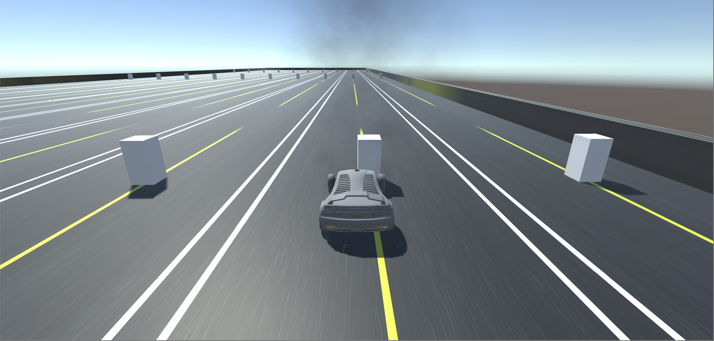
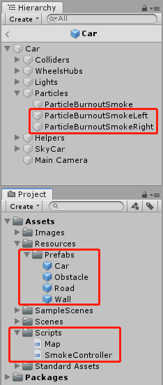
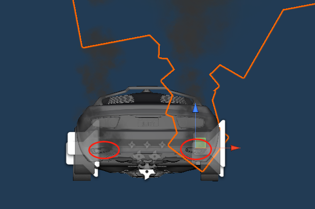
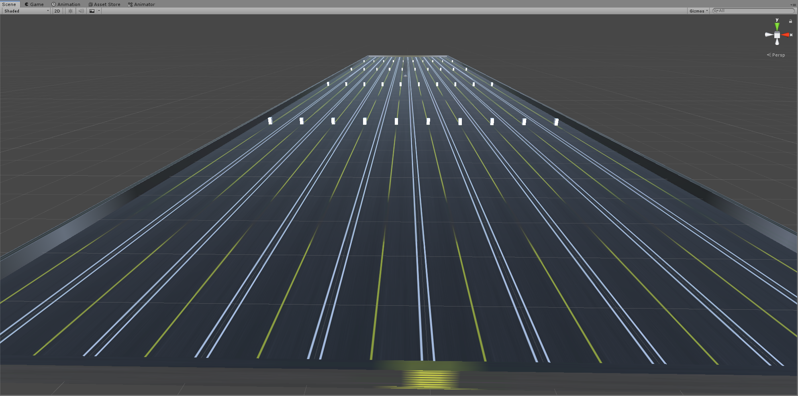

# 汽车尾气

视频链接：<https://www.bilibili.com/video/av74802975/>

## 游戏设计要求

 完善官方的“汽车尾气”模拟 

-  使用官方资源 Vehicle 的 car， 使用 Smoke 粒子系统模拟启动发动、运行、故障等场景效果 

## 游戏截图



## 制作预制

主要是完善官方资源 Vehicle 里的 car 的尾气粒子效果，另外是给场景添加道路、栏杆以及障碍物以供模拟。



在原有的汽车预制模型中，多添加两个粒子系统。样式为原有样式的基础上改变粒子的颜色，调整其位置和方向。



## 编写代码

代码主要是添加控制场景的生成，以及汽车尾气的控制。

### Map

生成跑道、栏杆和障碍物。

```c#
using UnityEngine;

public class Map : MonoBehaviour {
    public static GameObject roadPrefab;
    public static GameObject carPrefab;
    public static GameObject obstaclePrefab;
    public static GameObject wallPrefab;

    private void Awake() {
        roadPrefab = Resources.Load<GameObject>("Prefabs/Road");
        carPrefab = Resources.Load<GameObject>("Prefabs/Car");
        obstaclePrefab = Resources.Load<GameObject>("Prefabs/Obstacle");
        wallPrefab = Resources.Load<GameObject>("Prefabs/Wall");
    }

    private void Start() {
        LoadCar();
        LoadRoad();
        LoadObstacle();
        LoadWall();
    }

    private void LoadCar() {
        GameObject car = Instantiate(carPrefab);
        car.transform.position = new Vector3(-2.5f, 0, 0);
    }

    private void LoadRoad() {
        for (int i = 0; i < 5; i++) {
            GameObject roadL = Instantiate(roadPrefab);
            roadL.transform.position = new Vector3(5 + 10 * i, 0, 0);
            GameObject roadR = Instantiate(roadPrefab);
            roadR.transform.position = new Vector3(-5 - 10 * i, 0, 0);
        }
    }

    private void LoadObstacle() {
        for (int i = 0; i < 5; i++) {
            for (int j = 0; j < 2; j++) {
                GameObject obstacle1 = Instantiate(obstaclePrefab);
                obstacle1.transform.position = new Vector3(5 + 10 * i, 1, 50 + 100 * j);
                GameObject obstacle2 = Instantiate(obstaclePrefab);
                obstacle2.transform.position = new Vector3(-5 - 10 * i, 1, -50 - 100 * j);
                GameObject obstacle3 = Instantiate(obstaclePrefab);
                obstacle3.transform.position = new Vector3(-5 - 10 * i, 1, 50 + 100 * j);
                GameObject obstacle4 = Instantiate(obstaclePrefab);
                obstacle4.transform.position = new Vector3(5 + 10 * i, 1, -50 - 100 * j);
            }
        }
    }

    private void LoadWall() {
        GameObject wallL = Instantiate(wallPrefab);
        wallL.transform.position = new Vector3(-49.5f, 1, 0);
        wallL.transform.localScale = new Vector3(1, 2, 500);
        GameObject wallR = Instantiate(wallPrefab);
        wallR.transform.position = new Vector3(49.5f, 1, 0);
        wallR.transform.localScale = new Vector3(1, 2, 500);
        GameObject wallU = Instantiate(wallPrefab);
        wallU.transform.position = new Vector3(0, 1, 250);
        wallU.transform.localScale = new Vector3(100, 2, 1);
        GameObject wallD = Instantiate(wallPrefab);
        wallD.transform.position = new Vector3(0, 1, -250);
        wallD.transform.localScale = new Vector3(100, 2, 1);
    }
}
```



### SmokeController

尾气控制类。

```c#
using UnityEngine;
using UnityStandardAssets.Vehicles.Car;

public class SmokeController : MonoBehaviour {
    public float engineRevs;
    public float exhaustRate;
    public GameObject car;
    public CarController carController;
    private ParticleSystem exhaust;

    private void Start() {
        exhaust = GetComponent<ParticleSystem>();
        car = transform.parent.parent.gameObject;
        carController = car.GetComponent<CarController>();
        exhaustRate = 5000;
    }

    [System.Obsolete]
    private void Update() {
        // 根据引擎的转速调整粒子释放速率
        engineRevs = carController.Revs;
        exhaust.emissionRate = engineRevs * exhaustRate + 10;
        // 控制粒子的 color over lift time 属性
        var col = exhaust.colorOverLifetime;
        var grad = new Gradient();
        var colorKeys = new GradientColorKey[] { new GradientColorKey(Color.white, 0.0f), new GradientColorKey(new Color(214, 189, 151), 0.079f), new GradientColorKey(Color.white, 1.0f) };
        var alphaKeys = new GradientAlphaKey[] { new GradientAlphaKey(0.0f, 0.0f), new GradientAlphaKey(20f / 255f, 0.061f), new GradientAlphaKey(0.0f, 1.0f) };
        grad.SetKeys(colorKeys, alphaKeys);
        col.color = grad;
    }
}
```

