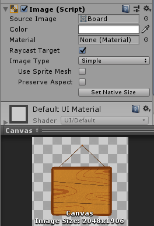
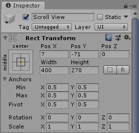
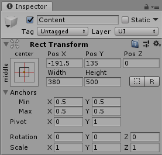
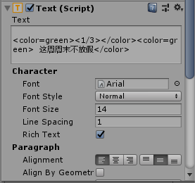

# 公告牌

视频链接： <https://member.bilibili.com/v2#/upload-manager/article>

## 游戏设计要求

-   使用 UGUI 实现 **[Quest Log](http://www.tasharen.com/ngui/example9.html) 公告牌**效果 

## 游戏截图


## 制作预制

制作一个Button的预制，主要是设置按钮的背景图片和其Text子对象的文字格式（左对齐），以及方便后面统一绑定代码定制相同的点击行为。

## 设计场景

先创建一个Scroll View，然后在Content下创建3个Button（使用预制的Button）和3个Text。（见上图）

给Canvas对象添加一个Image组件，并为其设置背景图片。



调整Scroll View对象和Content对象的宽度和高度。编写所有Text的内容，可以使用html的格式修改文字颜色。

|  Scroll View   |    Content     |      Text      |
| :------------: | :------------: | :------------: |
|  |  |  |

## 编写代码

参考了师兄的代码后知道，原来可以使用协程来实现动画，那太棒了，所以自己也来尝试一下。

代码主要是控制文本框的行为，通过按钮的点击来控制文本框的展开和关闭。

```c#
using System.Collections;
using UnityEngine;
using UnityEngine.UI;

public class ButtonClick : MonoBehaviour {

    public Text text;  // 绑定一个Text对象
    private int frame = 20;
    private float text_width = 0;

    // 初始化工作
    void Start() {
        gameObject.GetComponent<Button>().onClick.AddListener(ActionOnClick);
        text_width = text.rectTransform.sizeDelta.x;
    }

    // 点击按钮逻辑
    void ActionOnClick() {
        // 根据文本框状态执行相应动画
        if (text.gameObject.activeSelf) {
            StartCoroutine(CloseText());
        } else {
            StartCoroutine(OpenText());
        }
    }

    // 文本框关闭动画
    private IEnumerator CloseText() {
        // 设定旋转的初始值和旋转速度
        float rotation_x = 0;
        float rotate_speed = 90f / frame;

        // 设定文本框高度初始值和缩放速度
        float text_height = 80f;
        float scale_speedh = text_height / frame;

        // 执行动画
        for (int i = 0; i < frame; i++) {
            rotation_x -= rotate_speed;
            text_height -= scale_speedh;
            // 设置文本框的旋转角度和高度
            text.transform.rotation = Quaternion.Euler(rotation_x, 0, 0);
            text.rectTransform.sizeDelta = new Vector2(text_width, text_height);
            // 动画结束
            if (i == frame - 1) {
                text.gameObject.SetActive(false);
            }
            yield return null;
        }
    }

    // 文本框打开动画
    private IEnumerator OpenText() {
        // 设定旋转的初始值和旋转速度
        float rotation_x = -90;
        float rotate_speed = 90f / frame;

        // 设定文本框高度初始值和缩放速度
        float text_height = 0;
        float scale_speedh = 80f / frame;

        // 执行动画
        for (int i = 0; i < frame; i++) {
            rotation_x += rotate_speed;
            text_height += scale_speedh;
            // 设置文本框的旋转角度和高度
            text.transform.rotation = Quaternion.Euler(rotation_x, 0, 0);
            text.rectTransform.sizeDelta = new Vector2(text_width, text_height);
            // 动画结束
            if (i == 0) {
                text.gameObject.SetActive(true);
            }
            yield return null;
        }
    }
}
```


